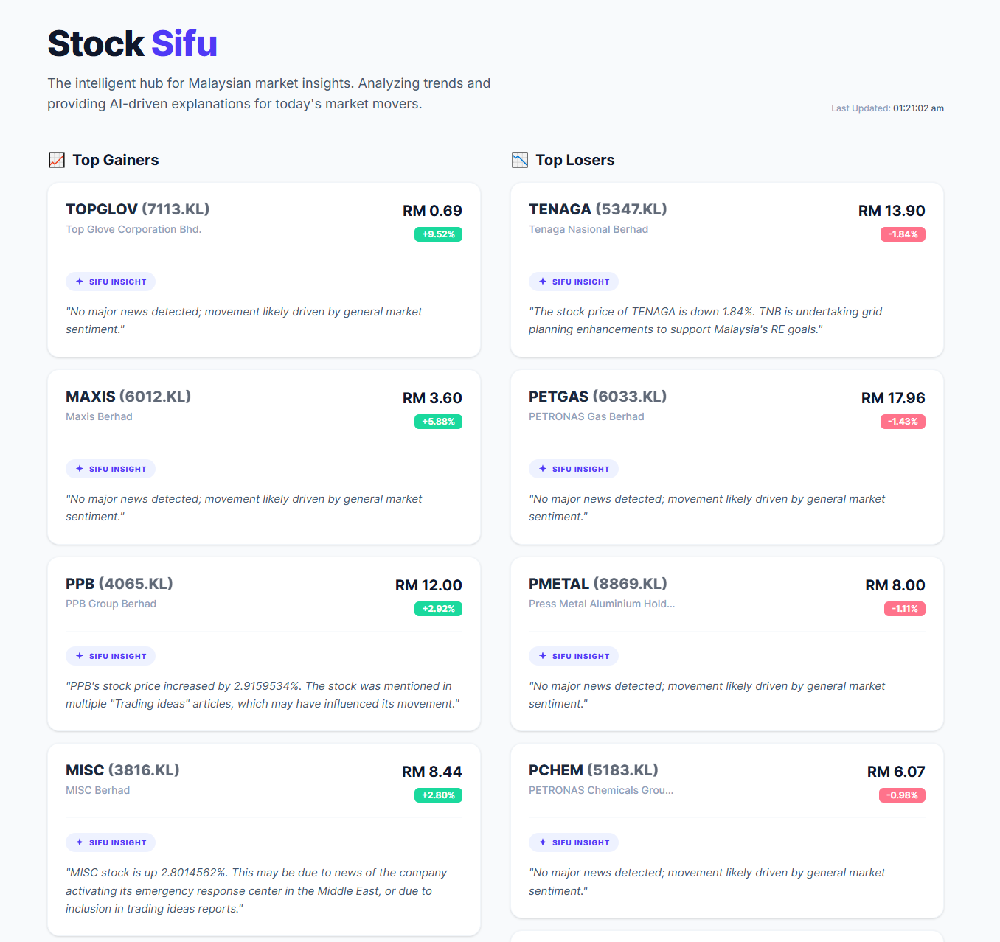

# 📊 Stock Sifu

Stock Sifu is a lightweight dashboard that provides quick insights into Malaysian stock market movers.
It highlights top gainers and losers among major Bursa Malaysia stocks, along with AI-generated explanations for price movements.

---

## 🚀 Features

- 📈 Top Gainers & 📉 Top Losers (daily)
- 🤖 AI-generated insights based on recent news
- 📰 News aggregation for each stock
- ⚡ Fast and simple dashboard UI
- ⏱️ Automated daily updates (cron job)

---

## 🧠 How It Works

1. Fetch stock data using Yahoo Finance
2. Identify top gainers and losers from selected major Malaysian stocks
3. Retrieve relevant news articles using GNews
4. Generate concise explanations using an LLM via OpenRouter
5. Display results in a clean dashboard

---

## 🛠️ Tech Stack

- **Frontend:** Next.js, React, Tailwind CSS, TypeScript
- **Backend:** Next.js API Routes
- **Stock Data:** Yahoo Finance (`yahoo-finance2`)
- **News API:** GNews
- **AI / LLM:** OpenRouter
  - Model: `stepfun/step-3.5-flash:free`

- **Deployment:** Vercel

---

## ⚙️ Environment Variables

Create a `.env.local` file:

```bash
GNEWS_API_KEY=your_gnews_api_key
OPENROUTER_API_KEY=your_openrouter_api_key
```

---

## 🕒 Cron Job

The app uses a scheduled job to refresh market data:

- Runs every weekday at **6:00 PM MYT**
- Pre-computes stock insights for faster loading

---

## 📌 Notes

- Data is limited to a selected set of major Bursa Malaysia stocks (V1 scope)
- Some stocks may not have relevant news available
- AI insights are informational and not financial advice

---

## 🔮 Future Improvements (V2 Ideas)

- Broader market coverage (more stocks)
- Improved news relevance & filtering
- Historical insights / weekly summaries
- Better caching & performance optimization
- UI/UX enhancements

---

## 📷 Preview



---

## 🙌 Acknowledgements

- Yahoo Finance for stock data
- GNews for news aggregation
- OpenRouter for LLM access

---

## 📄 License

MIT License
